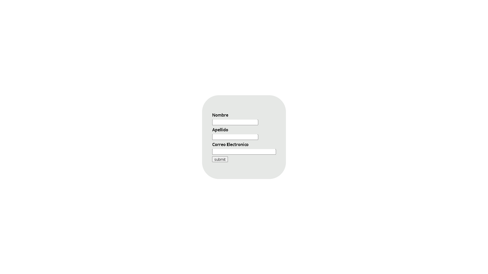
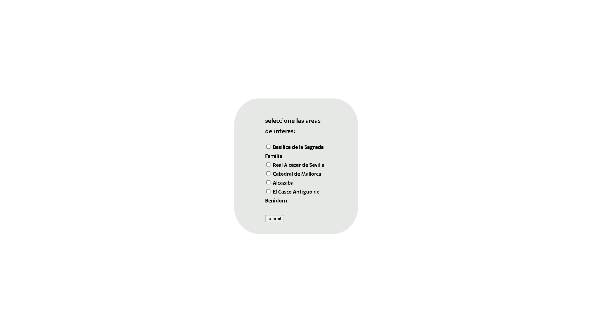
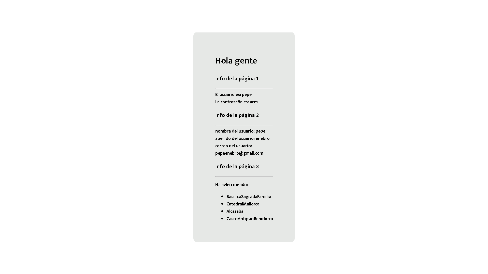

# formulario-recolector1
formulario compuesto de varias hojas que recolector con php(simple-practicas)
Esta practica se mando ha realizar en la asignatura de entornos servidor con PHP.
## SCREENSHOT

